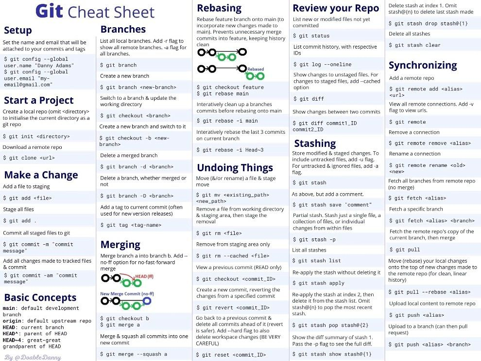

# My Simpleton Commandline Git Workflow


This is a simple description of how I work 99% of the time, as I am a simpleton. Origin/main is the new origin/master for future repositories, I just note both here for completeness because I use origin master for a lot of current repos.

1. I first make sure I am uptodate on origin/master or origin/main by git pulling.
  1. ```git checkout origin master```
  2. ```git pull origin master```
2. I start making changes to the local copy on my local machine.
3. When it gets to a point where I want to save my changes, I:
  1. ```git stash push```
  2. ```git checkout -b <branch name which will be made into a PR>```
  3. ```git stash pop```
4. I then commit the changes to the new branch, using for example, ```git add <file>```
  1. ```git commit```
5. When I am ready to create the PR, I create and push to the remote branch:
  1. ```git push origin <branch name which will be made into a PR>```
6. Github will tell me if master/main has diverged past a state where my commits can be merged in without conflict. If there is a possible conflict, I will merge in origin master/main to my local copy and then push to the PR branch again:
  1. ```git pull origin master (or origin main)```
  2. I resolve locally conflicts through ```git mergetool``` which, for me, is vim's three way diff tool.
  3. I commit the updated conflicts and push to the remote branch - ```git add <files> && git commit && git push origin <branch name which will be made into a PR>```
7. Often at this point I find I have to add new commits to fix things I have broken or have been flagged up in PR review.
  1. ```git commit```
  2. ```git push origin <branch name which will be made into a PR>```
8. Reviewers now have some of their comments made on stale commits in Github. This is better than squashing the commits I find because sometimes the commits are not stale and their comments are still valid, and it becomes easier to keep track of. They can view the 'files changed' tab to add review comments until they are happy. I loop back to check whether master/main has diverged, and if it hasn't just keep adding commits to address their concerns.
9. The PR gets approved (hopefully)
10. I merge the PR into master or main
11. I delete the old branch

AND For when everything goes to sh!t - [https://ohshitgit.com/](https://ohshitgit.com/)



